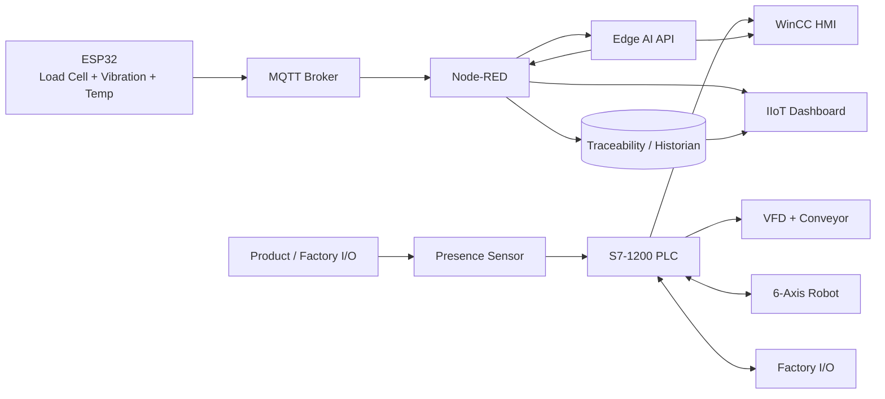
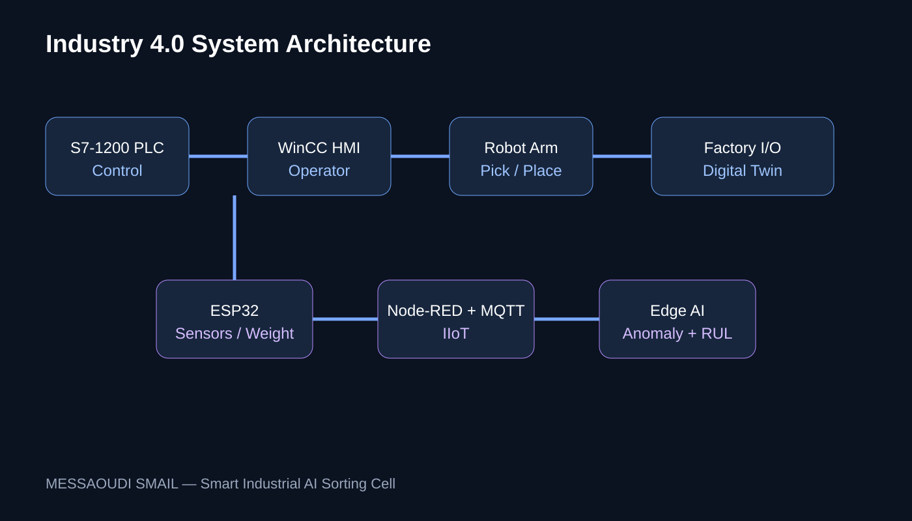
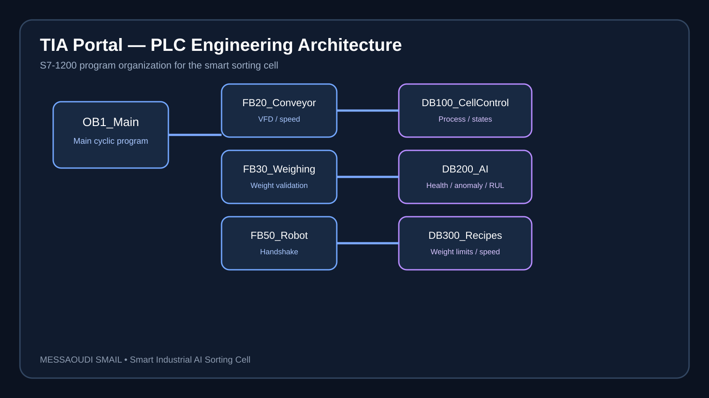
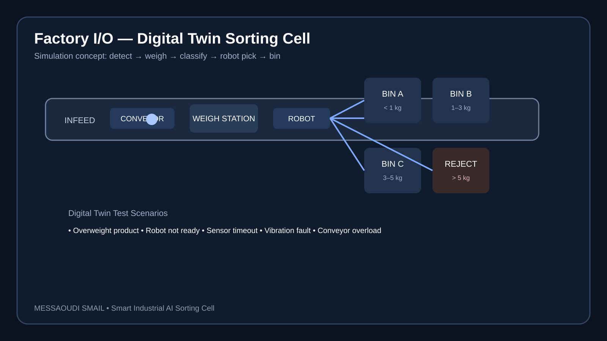
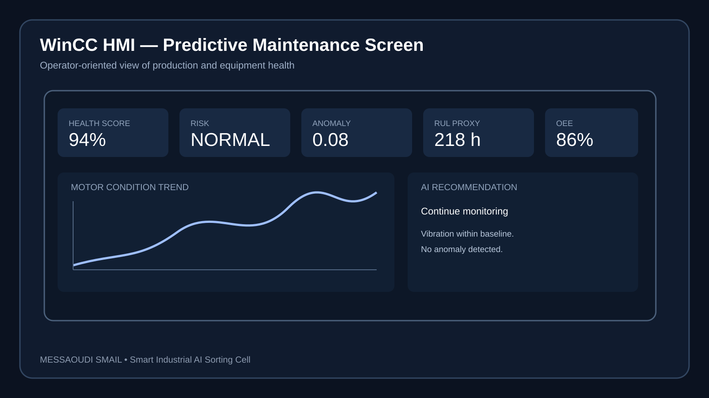
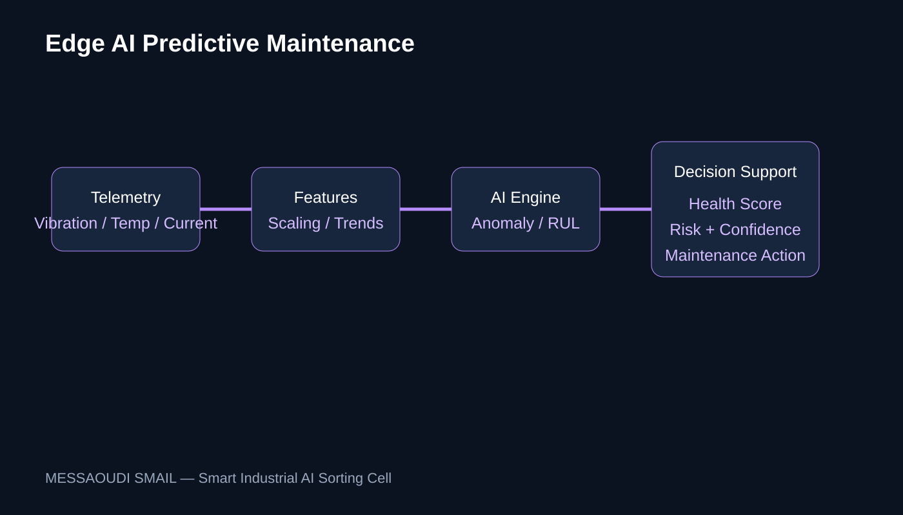

# 🏭 Smart Industrial AI Sorting Cell — V3 Portfolio

> **Industry 4.0 portfolio project:** Siemens S7-1200 + HMI + ESP32 + Edge AI + IIoT + Node-RED + Robotics + Factory I/O + Predictive Maintenance

**Author: MESSAOUDI SMAIL**

[](#)
[](#)
[](#)
[](#)
[](#)
[](#)
[](#)

---

## 🎯 Executive Summary

This project demonstrates an end-to-end **smart manufacturing cell** designed as a professional automation portfolio.

Products move through a conveyor, are detected and weighed, classified by configurable recipes, and automatically routed by a robotic arm. Sensor telemetry from an ESP32 is published through MQTT to Node-RED, where an Edge AI service evaluates equipment health and predicts maintenance risk.

**The key engineering principle is separation of responsibilities:**

- **PLC:** deterministic real-time control and sequence
- **HMI:** operator control and machine visualization
- **Robot:** validated pick-and-place execution
- **ESP32:** sensor/IIoT acquisition
- **Node-RED:** industrial data orchestration
- **Edge AI:** predictive analytics and decision support
- **Factory I/O:** digital twin and simulation
- **Database/analytics:** traceability and OEE

> AI is advisory. Safety and deterministic control remain independent of the AI layer.

---

## 🧠 What this project proves to a recruiter

### Automation
- Siemens S7-1200 architecture
- PLC state machine
- Digital I/O
- Recipe management
- VFD/conveyor control
- Interlocks and fault states

### HMI / SCADA
- Operator overview
- Production KPIs
- Alarm management
- AI maintenance screen
- Trends and diagnostics

### Robotics
- Pick-and-place sequence
- Target selection A/B/C/Reject
- PLC ↔ Robot handshake
- Ready / Busy / Done / Fault states

### IIoT
- ESP32 sensor gateway
- MQTT telemetry
- Node-RED orchestration
- REST AI API
- Historian/traceability concept

### AI
- Predictive maintenance
- Health score
- Risk classification
- Confidence
- Feature engineering
- Edge deployment architecture

### Digital Twin
- Factory I/O cell
- PLC tag mapping
- Fault injection
- Simulation-first commissioning

### Manufacturing Analytics
- OEE
- Availability
- Performance
- Quality
- Reject analysis
- Cycle-time monitoring

---

## 🏗️ Architecture



---

## 🔄 Process

```text
START
  ↓
Safety / communication checks
  ↓
Conveyor feed
  ↓
Product detection
  ↓
Weight acquisition
  ↓
Recipe classification
  ↓
A / B / C / REJECT
  ↓
Robot pick
  ↓
Robot place
  ↓
Traceability event
  ↓
Production + OEE update
  ↓
Next cycle
```

---

## ⚖️ Intelligent weight sorting

Default recipe:

| Weight | Destination |
|---:|---|
| `< 1.0 kg` | Bin A |
| `1.0–<3.0 kg` | Bin B |
| `3.0–5.0 kg` | Bin C |
| `> 5.0 kg` | Reject |

Thresholds are configurable through the recipe layer.

---

## 🤖 AI Predictive Maintenance

Telemetry:

- vibration RMS
- temperature
- motor current
- cycle time

Outputs:

```text
Health Score: 0–100
Risk: NORMAL / WARNING / CRITICAL
Confidence: 0–1
Predicted Fault Class
Maintenance Recommendation
```

Example:

```json
{
  "health_score": 72.4,
  "risk_level": "WARNING",
  "confidence": 0.91,
  "predicted_fault_class": 1,
  "recommendation": "Inspect vibration and temperature trend"
}
```

---

## 📊 OEE

The V3 architecture includes:

```text
Availability = Run Time / Planned Production Time

Performance = Ideal Cycle Time × Total Count / Run Time

Quality = Good Count / Total Count

OEE = Availability × Performance × Quality
```

This connects automation data with real manufacturing KPIs.

---

## 🧾 Traceability

Each production cycle can contain:

```text
Cycle ID
Timestamp
Weight
Weight Class
Destination
Cycle Time
Robot Status
AI Health Score
AI Risk
```

This enables production history and root-cause analysis.

---

## 🖥️ HMI screens

### 01 — Overview
Machine state, current product, robot state, AI health, alarms.

### 02 — Production
Counters, throughput, reject rate, OEE.

### 03 — Predictive Maintenance
Vibration, temperature, current, AI score and recommendation.

### 04 — Recipe
Weight thresholds, conveyor speed and recipe selection.

### 05 — Diagnostics
I/O, PLC, robot, ESP32, MQTT and AI connectivity.

### 06 — Alarms
Active/history, severity, acknowledge and reset.

---

## 📱 IIoT Dashboard

Recommended professional dashboard:

- OEE gauge
- production/hour
- reject rate
- current weight
- bin distribution
- robot state
- conveyor state
- AI health trend
- vibration trend
- temperature trend
- alarm timeline
- traceability search

---

## 🧪 Factory I/O test scenarios

The V3 project includes fault-injection scenarios:

1. Conveyor overload
2. Increasing bearing vibration
3. Temperature rise
4. Product sensor failure
5. Robot not ready
6. Overweight product
7. Communication loss

These scenarios are especially useful during a technical interview because they demonstrate **commissioning and troubleshooting**, not only programming.

---

## 📁 Repository map

```text
├── ai/                     Edge AI model + API
├── analytics/              OEE + traceability
├── dashboard/              Portfolio dashboard specification
├── docs/                   Architecture + cybersecurity
├── esp32/                  Sensor gateway
├── factory_io/             Digital twin + fault injection
├── plc/
│   ├── S7_1200/            PLC tags + SCL sequence
│   └── HMI/                HMI engineering specification
├── robot/                  Robot adapter + handshake
├── demo/                   Interview/demo scenarios
├── .github/                CI + issue templates
└── docker-compose.yml      MQTT + Node-RED + AI
```

---

## 🚀 Quick demo

### 1. Start IIoT stack

```bash
docker compose up -d
```

### 2. Start AI

```bash
cd ai
python -m venv .venv
source .venv/bin/activate
pip install -r requirements.txt
python train_model.py
uvicorn predict_service:app --host 0.0.0.0 --port 8000
```

### 3. Start Node-RED

Open:

```text
http://localhost:1880
```

### 4. Run ESP32

Configure:

```text
WIFI_SSID
WIFI_PASS
MQTT_HOST
```

Upload using PlatformIO.

### 5. Simulate

Open the Factory I/O scene and map the tags defined in:

```text
factory_io/tags.csv
```

---

## 🎤 60-second interview pitch

> I designed an Industry 4.0 sorting cell around a Siemens S7-1200 PLC. The PLC controls the deterministic production sequence, conveyor and robot handshake. An ESP32 acquires weight, vibration and temperature data and publishes it through MQTT. Node-RED orchestrates the IIoT layer and sends machine features to an Edge AI model for predictive-maintenance scoring. The operator can monitor production, OEE, alarms and equipment health through HMI and dashboard interfaces, while Factory I/O provides a digital twin for testing and fault injection. The architecture keeps AI advisory and safety-critical control independent, which makes the concept closer to a real industrial system.

---

## 🧑‍💼 CV / LinkedIn project entry

**Smart Industrial AI Sorting Cell — Industry 4.0 Portfolio Project**

- Designed a Siemens S7-1200 based automated sorting cell integrating HMI, VFD, robotic pick-and-place and Factory I/O digital twin.
- Developed ESP32 IIoT acquisition for weight, vibration and temperature with MQTT telemetry.
- Implemented Edge AI predictive-maintenance scoring using machine-condition features and confidence estimation.
- Built Node-RED orchestration architecture for telemetry, AI integration and dashboard visualization.
- Added configurable weight recipes, production traceability, OEE framework, alarms and fault-injection scenarios.
- Designed PLC ↔ Robot handshake and simulation-oriented commissioning workflow.

**Technologies:** Siemens S7-1200, TIA Portal, WinCC, Factory I/O, ESP32, MQTT, Node-RED, Python, FastAPI, Scikit-learn, Docker, Robotics, Predictive Maintenance.

---

## 🔐 Engineering & safety note

This repository is a **portfolio/reference implementation**. A real machine requires a formal risk assessment, safety circuit design, safety PLC/relay where required, robot safety configuration, guarding, STO, validated interlocks and commissioning according to the actual equipment and applicable standards.

---

## 👨‍💻 Author

**MESSAOUDI SMAIL**

**Industrial Automation | PLC | Robotics | IIoT | Edge AI | Industry 4.0**

---


## 🖼️ Project Visual Gallery

### System Architecture


### TIA Portal PLC Architecture


### Factory I/O Digital Twin


### WinCC AI / Predictive Maintenance


### Edge AI Pipeline


These visuals are portfolio diagrams/mockups. Replace or supplement them with screenshots from the actual TIA Portal, WinCC and Factory I/O installation for a final production portfolio.
