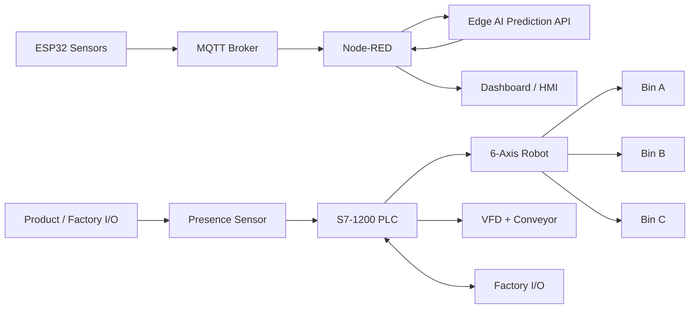

# System architecture

## Control philosophy

The PLC controls the deterministic sequence. ESP32 and Node-RED provide telemetry and IIoT services. AI produces advisory health/risk information. The robot executes validated pick-and-place commands. Factory I/O provides a digital twin for simulation.
